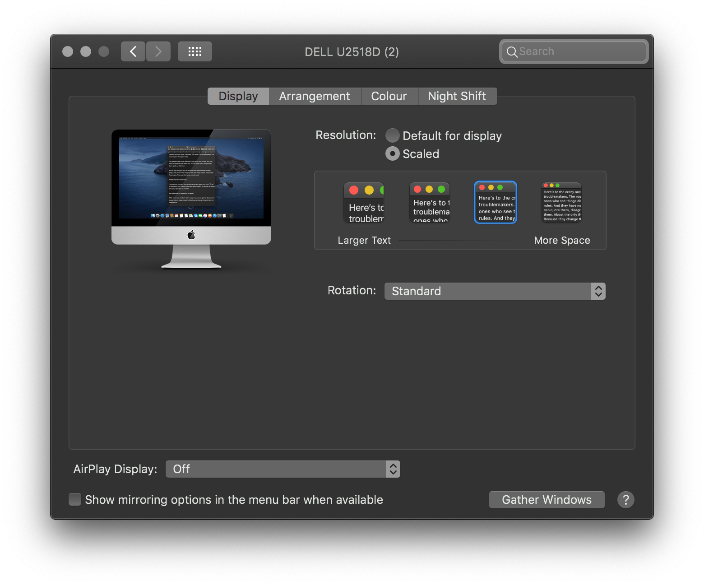
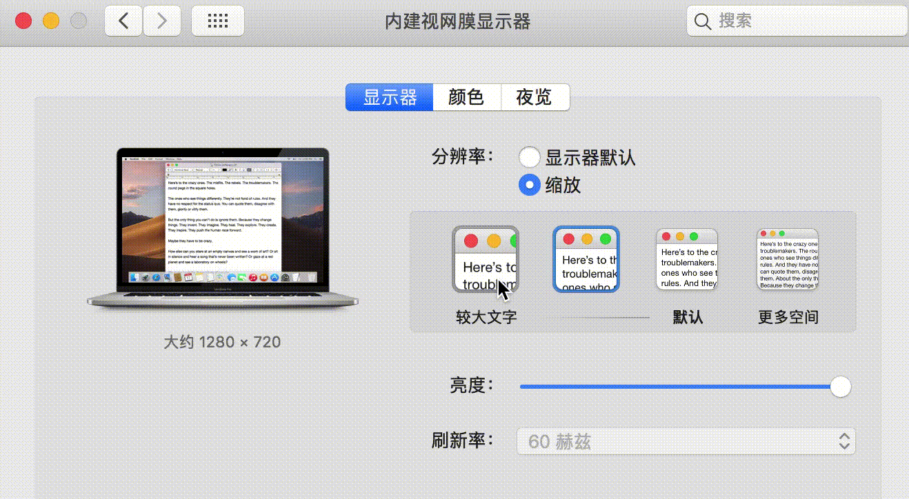
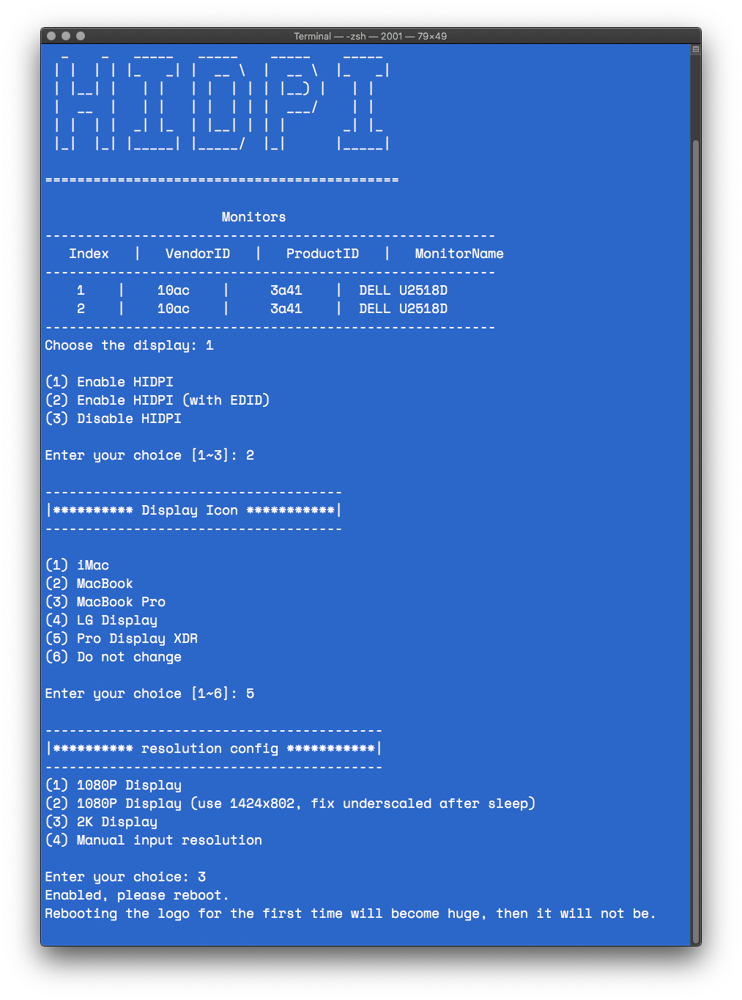

#  Enable macOS HiDPI 

## Explanation

This script can simulate native macOS HiDPI on a non-Apple (or-non-Retina) display, and create scaled options in System Preferences.

NOTE: Some devices have wake-up issues, the script's second option may help in these cases by injecting a patched EDID, but may cause problems depending on your OS version. Logo up-scaling may not be resolved, because the higher resolution is faked.

## As seen in System Preferences:





## Usage

Run this script in Terminal (copy and paste the entire line, NOTE: Internet access is required)
Select desired options when prompted, reboot upon completion.

```bash
sh -c "$(curl -fsSL https://raw.githubusercontent.com/raumfahrerspiffy/turbo.io/master/hidpi.sh)"
```



## Recovery (in case of problems)

### Normal

Run the script again in the terminal, but choose option 3 (to disable HiDPI)

### Recovery mode

If you cant boot into system, or get any another issues, you can boot into macOS Recovery mode, and use the Terminal.app

There are two ways to close it. It is recommended to choose the first one

Option 1. 

```bash
ls /Volumes/
cd /Volumes/"Your System Disk Part"/System/Library/Displays/Contents/Resources/Overrides/HIDPI

./disable
```

Option 2. 

Remove your display's DisplayVendorID folder under `/System/Library/Displays/Contents/Resources/Overrides` , and move backup files

Please use a single display to execute the following commands. If it is a laptop, turn off the internal monitor when turning off the HIDPI of the external monitor.

In Terminal: 

```bash
ls /Volumes/
cd /Volumes/"Your System Disk Part"/System/Library/Displays/Contents/Resources/Overrides
EDID=($(ioreg -lw0 | grep -i "IODisplayEDID" | sed -e "/[^<]*</s///" -e "s/\>//"))
Vid=($(echo $EDID | cut -c18-20))
rm -rf ./DisplayVendorID-$Vid
cp -r ./HIDPI/backup/* ./
```

## Inspired

https://www.tonymacx86.com/threads/solved-black-screen-with-gtx-1070-lg-ultrafine-5k-sierra-10-12-4.219872/page-4#post-1644805

https://github.com/syscl/Enable-HiDPI-OSX
